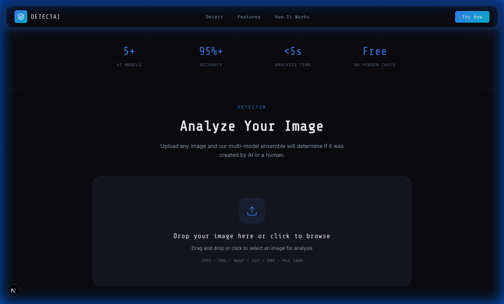
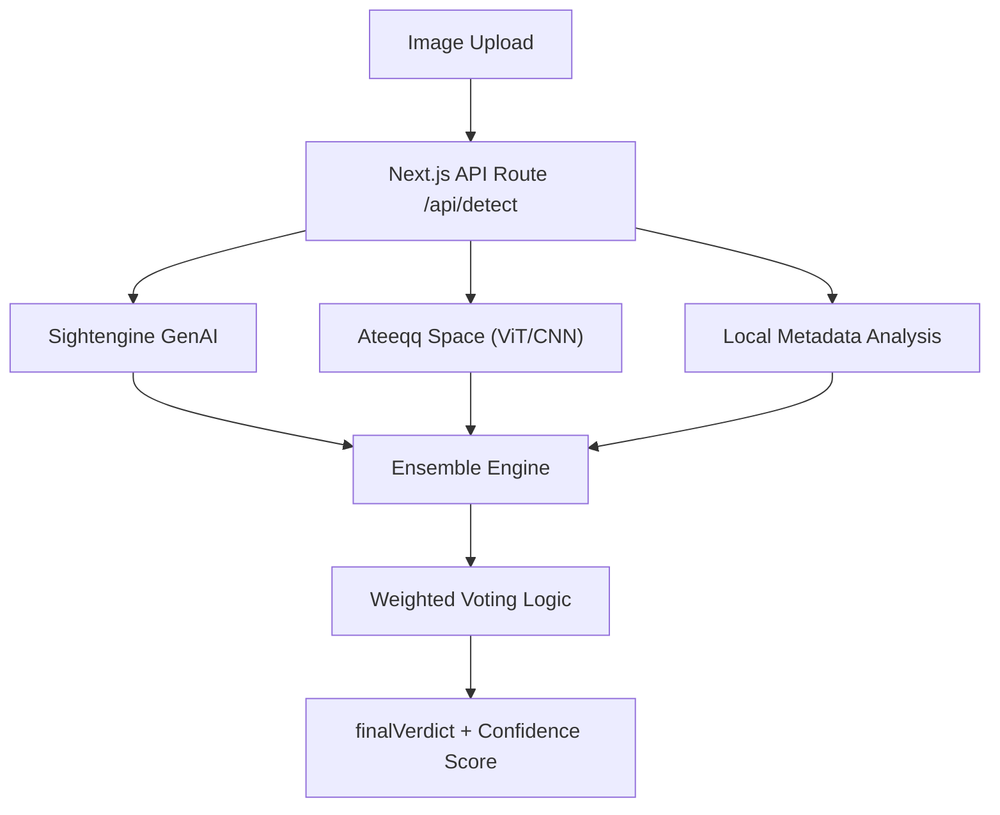

# 🕵️‍♂️ AI Image Detector



> **Advanced Hybrid Intelligence** for detecting AI-generated images. Combines commercial-grade APIs, cutting-edge open-source models, and privacy-first local analysis.

## 🔗 Live Demo
**[https://aiimagedetector-ten.vercel.app](https://aiimagedetector-ten.vercel.app)**

## 🚀 Features

-   **Multi-Engine Ensemble**: Uses 3 independent detection engines for maximum reliability.
    -   **Sightengine GenAI**: Commercial-grade detection for DALL-E, Midjourney, Stable Diffusion.
    -   **Ateeqq Space (ViT)**: High-accuracy Vision Transformer hosted on Hugging Face Spaces.
    -   **Local Metadata Engine**: specialized heuristic analysis of EXIF data, AI tool markers, and entropy.
-   **Weighted Voting System**: Smart aggregation logic that reduces false positives by cross-validating results.
-   **Cyberpunk UI**: A stunning, responsive interface with neon aesthetics, glassmorphism, and smooth animations.
-   **Privacy-First**: Images are processed in real-time and never stored.
-   **Drag & Drop**: Intuitive upload zone with file validation and preview.

## 🛠️ Tech Stack

-   **Framework**: [Next.js 14 (App Router)](https://nextjs.org/)
-   **Language**: [TypeScript](https://www.typescriptlang.org/)
-   **Styling**: Vanilla CSS (Variables, Flexbox/Grid, Animations) - *No Tailwind dependency*
-   **AI Integration**:
    -   `@gradio/client` for Hugging Face Spaces
    -   `FormData` for Sightengine API
-   **Deployment**: [Vercel](https://vercel.com/)

## 📦 Installation

1.  **Clone the repository**:
    ```bash
    git clone https://github.com/your-username/ai-image-detector.git
    cd ai-image-detector
    ```

2.  **Install dependencies**:
    ```bash
    npm install
    ```

3.  **Set up Environment Variables**:
    Create a `.env.local` file in the root directory and add your keys:
    ```env
    # Sightengine API (Get free keys at sightengine.com)
    SIGHTENGINE_API_USER=your_user_id
    SIGHTENGINE_API_SECRET=your_api_secret

    # Hugging Face Token (Optional, for higher rate limits)
    HF_API_TOKEN=hf_your_token_here
    ```

4.  **Run Development Server**:
    ```bash
    npm run dev
    ```
    Open [http://localhost:3000](http://localhost:3000) to view the app.

## 🚀 Deployment

The easiest way to deploy is via **Vercel**.

1.  Push your code to GitHub.
2.  Import the project in Vercel.
3.  Add the Environment Variables (`SIGHTENGINE_API_USER`, `SIGHTENGINE_API_SECRET`, `HF_API_TOKEN`) in the Vercel project settings.
4.  Deploy!

## 🧩 Architecture



## 📄 License

MIT License. Free to use and modify.
